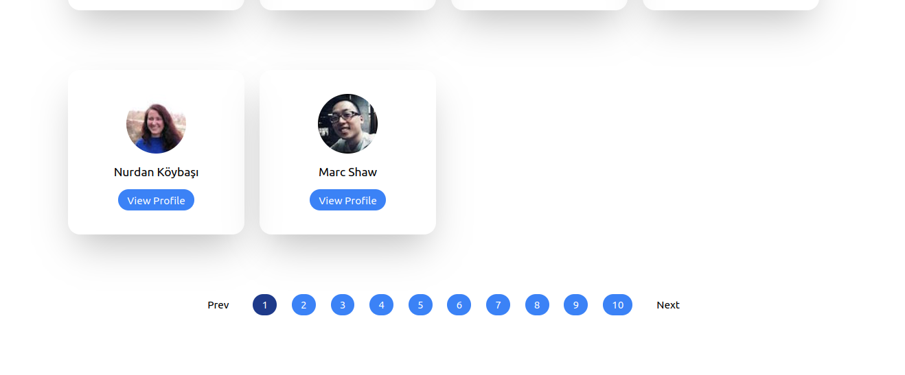

## Pagination

[Randomuser API](!https://randomuser.me/documentation)

Get users from API and render their info on to the page.
Get different set of reults based on page number

[Watch Live](https://pagination-react-adarshshahi.netlify.app/)

### Approach
> Maintained two states one for current page number and other for
> users on current page (**10**) and dependency of useEffect was 
> page state variable so whenever page changed useEffect was invoked
> and API was called 

```js
const URL =`https://randomuser.me/api/?page=${page}&results=10&seed=abc`
// seed was constant to get same results for a particular page.
```


#### Screenshots

* Landing Page


* Navigation Links

